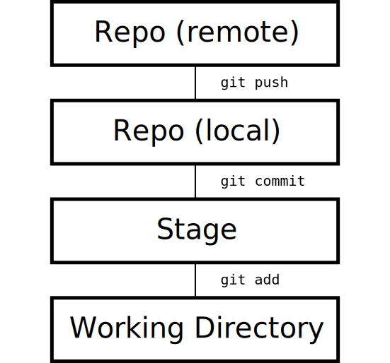
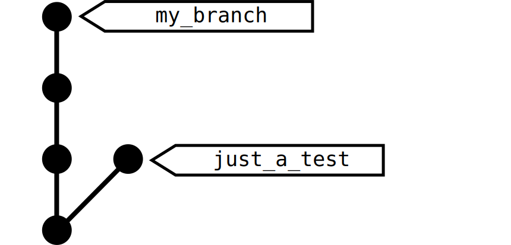
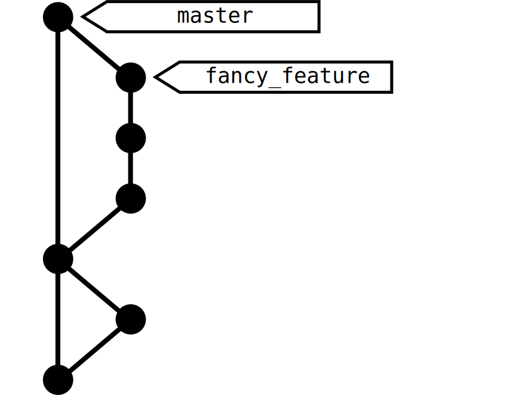
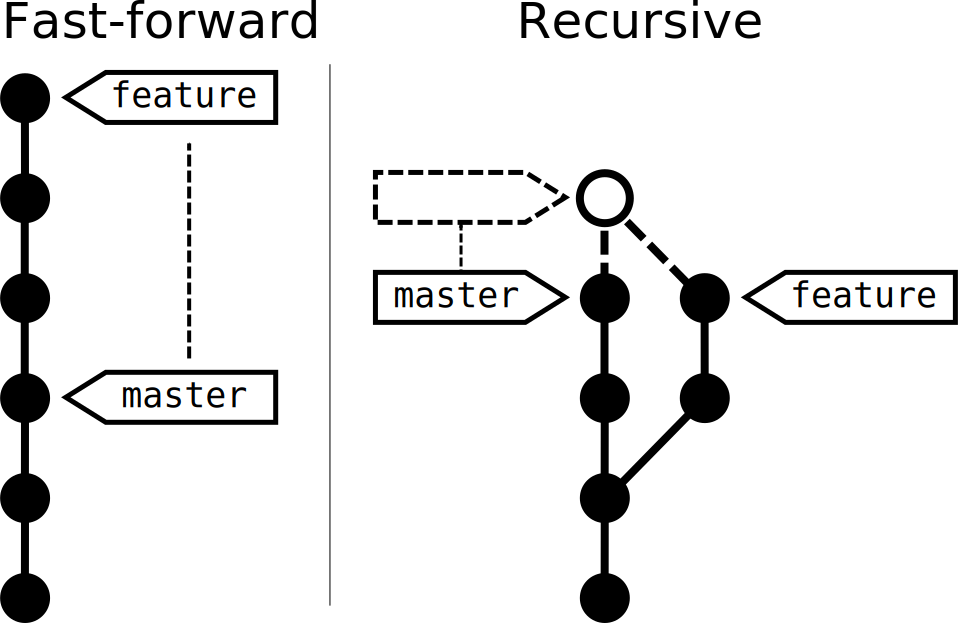
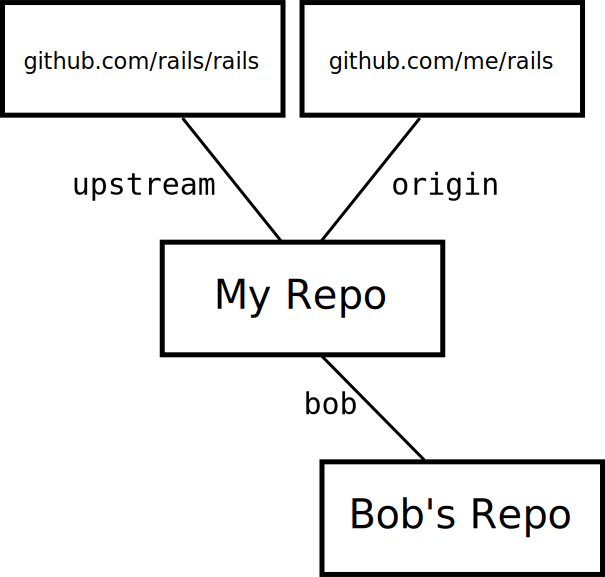
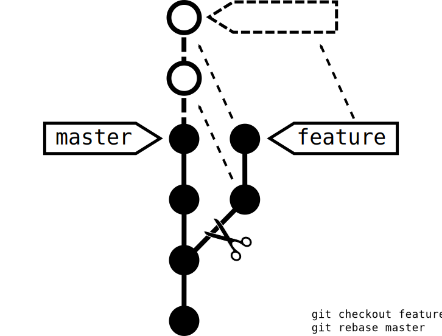

# Git Workshop

---

# Intro - why git?

* **distributed revision control system**
* initially designed and developed by Linus Torvalds for Linux kernel development in 2005
* most widely adopted version control system for software development

* unlike most client–server systems, every Git working directory is a full-fledged repository with complete history and full version-tracking capabilities
* independent of network access or a central server

---

# Theory

> finally figuring out that git commands are strangely named graph manipulation commands--creating/deleting nodes, moving pointers around

-- Kent Beck https://twitter.com/kentbeck/status/42657237986054144

---

## Basic Workflow



---

## Keeping a History


(https://xkcd.com/1296/)

* changes stored in commits
* each commit references its parent
* => linked list building a history of your code

---

## Branches

> git gets easier once you get the basic idea that branches are homeomorphic endofunctors mapping submanifolds of a Hilbert space.

-- https://twitter.com/tabqwerty/status/45611899953491968



* a branch is a named reference to a commit
* it moves along as you make new commits

---

## Dealing with branches



* working code is on `master` branch
* branch off to do your work
* throw away branches after merging to master branch

Getting fancy with Git flow:
http://nvie.com/posts/a-successful-git-branching-model/

---

## Merges

* "get that code from my branch into the `master` branch"
* what if target branch has changed in between time? **merge conflict**
    * trivial merges are made automatically
        * different file changed
        * same file, different location changed
    * changes to the same file in similar locations must be resolved manually

---

## Merge Strategies



* FF: does not touch history, only branches
* Recursive: creates a merge commit

---

## Remotes



  * "other locations" of your project's source code
  * conventions:
    * "**origin**", services our code centrally
    * "**upstream**", services as original code base when we are working on a fork

---

#  Now, git your hands dirty!

---

## Prerequisites (on Ubuntu)

```bash
sudo apt-get install git openssh-client
ssh-key-gen -b 4096 -C 'your.email@example.com'
```

---

## Configuring Git

```bash
git config --global user.name 'Your Name'
git config --global user.email 'your.email@example.com'
```

---

## Basic Commands

```bash
git help
```

---

## Getting started...

```bash
git clone
git status
```

Copy repo URL here: http://tiny.cc/kp_git_ws

---

## Stuff to stage ...

```bash
git add
git rm
git mv
```

---

## From Stage to Repository

```bash
git commit
```

Variants:

```bash
git commit -m 'Use describing message'
git commit -am 'Commit all the things!'
```

Pro Tip: https://github.com/erlang/otp/wiki/Writing-good-commit-messages

---

## Undo things

Warning, there be dragons ahead!

```bash
git reset
git revert
git clean
```

---

## Branches, Merges, Conflicts, ...

```bash
git branch
git checkout
git merge
```

---

## Getting fancy with rebase



* "Cuts" your history and "glues" it onto the desired commit
* actually does not cut anything, all commits are *replayed* (i.e. a copy is created)

---

## Working with remote repositories

```bash
git remote
git clone

git pull
git push
```

---

# Goodies

## Improve your git experience

* use bash aliases: alias gs='\git status'
* Customize your console: https://github.com/git/git/tree/master/contrib/completion

## Discover more git capabilities

* git stash
* git commit --amend
* git cherry-pick
* git reflog
* git rerere
* git instaweb --http=webrick

---

# Must Reads / Good Practices

* http://marklodato.github.io/visual-git-guide/index-en.html
* https://github.com/erlang/otp/wiki/Writing-good-commit-messages

* Keep your commits tiny, use ```git add -p``` often
* Keep commit messages short, "use present tense"

---

# Lost? Git Help!

  * The officials: http://git-scm.com/   -- "ProGit" book
  * Git Einführung: http://www.linuxtag.org/2013/fileadmin/www.linuxtag.org/slides/Julius_Plenz_-_Git-Einfuehrung.e141.pdf
  * Git Goodies: http://tokkee.org/talks/froscon12-git-goodies.pdf

---

# Questions?
