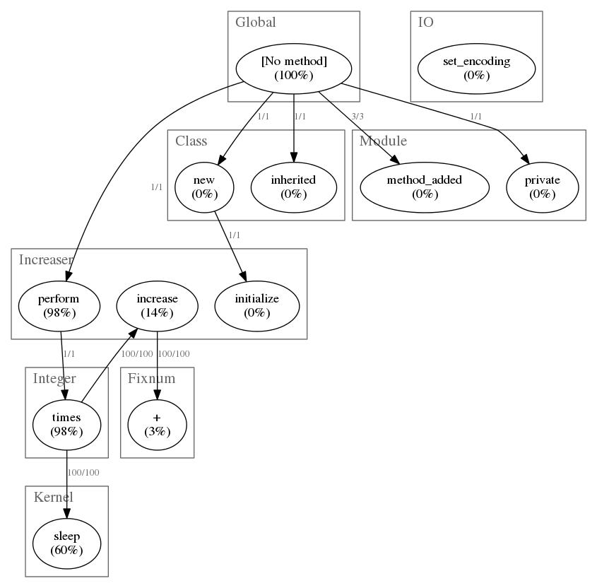

# Profiling Ruby using ruby-prof

---

# Why profiling?

  * not always clear what code parts are slowing down your script
  * see what methods take how long to run → optimize!

---
# ruby-prof

## what?

  * code profiler for MRI rubies
  * https://github.com/ruby-prof/ruby-prof

## install

```
$> gem install ruby-prof
```


---

## usage: sample code

```
class Increaser
  def initialize(iterations)
    @iterations = iterations
    @number = 0
  end

  def perform
    @iterations.times do |i|
      increase
      sleep 0.01
    end
  end

  private

  def increase
    @number += 1
  end

end

Increaser.new(100).perform

```

---
## usage: support for several output formats

```
-p, --printer=printer
```
  *   ```flat``` - Prints a flat profile as text (default).
  *   ```flat_with_line_numbers``` - same as flat, with line numbers.
  *   ```graph``` - Prints a graph profile as text.
  *   ```graph_html``` - Prints a graph profile as html.
  *   ```call_tree``` - format for KCacheGrind
  *   ```call_stack``` - prints a HTML visualization of the call tree
  *   ```dot``` - Prints a graph profile as a dot file **← super cool**

---

## usage: flat output 

```
$> ruby-prof increase.rb 
[...]
Sort by: self_time

 %self      total      self     child     calls  name
 56.99      0.006     0.006     0.000      100   Kernel#sleep 
 25.58      0.010     0.002     0.007        1   Integer#times 
 12.60      0.002     0.001     0.000      100   Increaser#increase 
  3.51      0.000     0.000     0.000      100   Fixnum#+ 
  0.99      0.010     0.000     0.010        2   Global#[No method] 
  0.18      0.000     0.000     0.000        2   IO#set_encoding 
  0.06      0.010     0.000     0.010        1   Increaser#perform 
  0.03      0.000     0.000     0.000        1   Increaser#initialize 
  0.02      0.000     0.000     0.000        3   Module#method_added 
  0.02      0.000     0.000     0.000        1   Class#new 
  0.02      0.000     0.000     0.000        1   Class#inherited 
  0.01      0.000     0.000     0.000        1   Module#private 
```

---

## usage: dot output

<p>
  
</p>

```
ruby-prof -p dot increase.rb | dot -Tpng > out.png
```

---
## usage: call_stack output

[Demo](http://192.168.59.104:8001)

---

## other nice things

See documentation and ```ruby-prof --help```

```
       --mode=measure_mode
             process - Process time (default).
             wall - Wall time.
             cpu - CPU time
             allocations - Object allocations
             memory - Allocated memory in KB
             gc_runs - Number of garbage collections
             gc_time - Time spent in garbage collection 

    -s, --sort=sort_mode
             total - Total time
             self - Self time
             wait - Wait time
             child - Child time


```


---

# profiling rails?

can be done using ruby-prof

* easy to set up: generate new ```RAILS_ENV=profile```
* results are harder to read, rails stack is huuuuuuuge
* still very handy: use ```call_stack``` printer for selected parts of code!

other, maybe better over-all or specialized solutions exists

* [rack-mini-profiler](https://github.com/MiniProfiler/rack-mini-profiler)
  * Middleware that displays speed badge for every html page
  * light database profiling
* [bullet](https://github.com/flyerhzm/bullet) - helps to identify
  ineffecient database queries

---

# FIN.

---


# Hint: markdown to impress

<a
href='https://raw.githubusercontent.com/hendrikb/know_your_tools/master/ruby-prof.md'>This document</a> is originally written in <a href='http://daringfireball.net/projects/markdown/'>markdown</a> but can be rendered into an
<a href="http://bartaz.github.io/impress.js/">impress.js</a> presentation using <a
href="https://github.com/egonSchiele/mdpress">mdpress</a>
